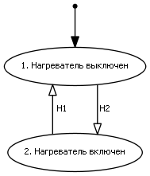

# 
Лабораторная работа №5.  Набиев Фарис, ИУ7-43Б.  Микроволновая печь

## Информационная модель

## Диаграммы и таблицы переходов состояний

### Нагреватель
  
|   |Н1 |Н2 |
|---|---|---|
|  1|  2|  x|
|  2|  x|  1|  
**Н1** - включение нагревателя  
**Н2** - выключение нагревателя  

***
### Поддон
  
|   |П1 |П2 |
|---|---|---|
|  1|  2|  x|
|  2|  x|  1|  
**П1** - запуск поддона  
**П2** - остановка поддона  

***
### Дверь
  
|   |Д1 |Д2 |
|---|---|---|
|  1|  2|  x|
|  2|  x|  1|
**Д1** - открытие двери  
**Д2** - закрытие двери  

***
### Таймер
  
|   |Т1 |Т2 |
|---|---|---|
|  1|  2|  x|
|  2|  x|  1|
**Т1** - запуск таймера  
**Т2** - остановка таймера  

***
### Кнопка
  
|   |К1 |К2 |
|---|---|---|
|  1|  2|  x|
|  2|  x|  1|
**К1** - нажатие на кнопку  
**К2** - отжатие кнопки  

***
### Микроволновая печь
  
|    |МП1 |МП2 |МП3 |МП4 |МП5 |МП6 |МП7 |
|----|----|----|----|----|----|----|----|
|   1|   2|   3|   x|   x|   x|   x|   x|
|   2|   x|   3|   4|   x|   x|   x|   x|
|   3|   2|   x|   4|   x|   x|   x|   x|
|   4|   x|   x|   x|   5|   6|   7|   x|
|   5|   x|   x|   4|   x|   x|   7|   x|
|   6|   x|   x|   x|   x|   x|   x|   1|
|   7|   x|   x|   x|   x|   x|   x|   1|

**МП1** - ввод времени  
**МП2** - выбор режима нагревания  
**МП3** - запуск нагревания  
**МП4** - остановка нагревания  
**МП5** - завершение нагревания  
**МП6** - отмена нагревания  
**МП7** - выключение МП  

## Модель взаимодействия объектов
  

## Канал управления

## Диаграмма потоков данных действий 

